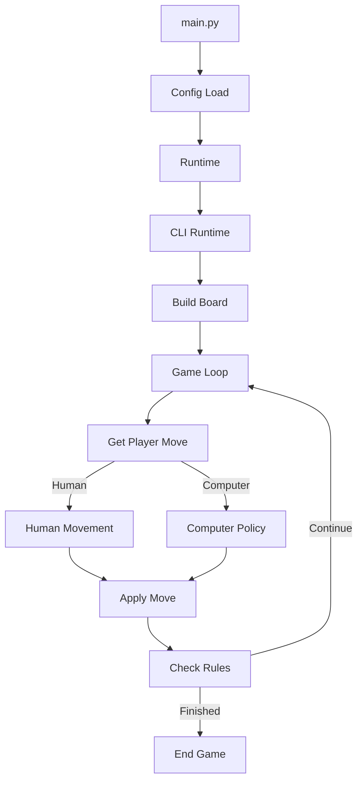
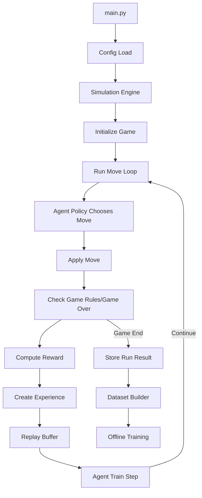

# Welcome to Tic-Tac-Terminal! #
## Tic-Tac-Toe (And other tic-tac-toe styled games) Simulation & Reinforcement Learning Framework

A modular game engine designed for:

* CLI gameplay
* Headless AI simulation
* Reinforcement learning experiments
* Offline dataset generation
* Policy experimentation

The project separates **game logic, players, rendering, simulation, and training** so each component can evolve independently.

---

# Design Philosophy

The system follows several design principles:

### Separation of Concerns

Game logic, simulation, training, and UI are separated.

### Registry-Driven Architecture

Rules, rewards, encoders, and policies are dynamically selected.

### Simulation-First Design

The engine supports:

* gameplay
* large scale simulations
* ML training pipelines

---

# Features

## Easy config control

* Configurable board size
* Human vs Human
* Human vs Computer
* Computer vs Computer
* CLI interface
* Headless simulation
* Reinforcement learning integration
* Replay buffer support
* Multiple board encoders
* Pluggable reward functions
* Pluggable AI policies
* Experiment-friendly architecture

---

# Installation

Requires **Python 3.12** (You can try other python versions but they have not been tested)

Local installation

bash
git clone <repo>
cd tic_tac_term

python -m venv venv
source venv/bin/activate

pip install -r requirements.txt

### Persistence

You can experiment locally with the core of the system without any additional work and the only true requirement is numpy.
The engine itself does not require a database connection but you will not have any persistent data. 

Please see the persistence directory readme for information about persistence.

---

# Running the Game

Start the CLI game:

bash
python3 main.py


Controls (default):

| Key               | Action      |
| ----------------- | ----------- |
| Arrow Keys / WASD | Move cursor |
| Enter / E         | Place piece |
| N                 | New game    |
| Q                 | Quit        |

---

# System Flow

## Runtime Game Flow



---

## Simulation / Training Flow



---

# Folder Overview

## Core Game State

```
core/
```

Responsible for representing and logging game state.

| File             | Purpose                               |
| ---------------- | ------------------------------------- |
| game_state.py    | Represents the current board state    |
| move.py          | Move object definition                |
| piece.py         | Board piece representation            |
| run_context.py   | Records moves and metadata for a game |
| serialization.py | Board serialization utilities         |

---

## Game Engine

```
game_engine/
```

Applies game mechanics.

| File           | Purpose                    |
| -------------- | -------------------------- |
| board_build.py | Creates game boards        |
| apply_move.py  | Applies moves to the board |

---

## Game Rules

```
game_types/
```

Contains rule definitions.

| File              | Purpose                        |
| ----------------- | ------------------------------ |
| standard.py       | Standard Tic-Tac-Toe rules     |
| rules_registry.py | Rule lookup system             |
| used_rules.py     | Wrapper selecting active rules |

---

## Players

```
players/
```

Handles human and AI players.

### Human Players

```
players/human_players
```

| File              | Purpose                |
| ----------------- | ---------------------- |
| cli_human.py      | CLI player interface   |
| human_movement.py | Key → move translation |
| registry.py       | Human player registry  |

### Computer Players

```
players/computer_players
```

| File                     | Purpose              |
| ------------------------ | -------------------- |
| computer_movement.py     | Executes AI moves    |
| agent_registry.py        | Stores active agents |
| model_policy_registry.py | Policy lookup        |

Policies:

```
policies/
```

| File              | Purpose                  |
| ----------------- | ------------------------ |
| base_policy.py    | Policy interface         |
| random_policy.py  | Random move AI           |
| rl_dumb_policy.py | Simple RL testing policy |

Agents:

```
agents/
```

| File             | Purpose         |
| ---------------- | --------------- |
| rl_dumb_agent.py | Simple RL agent |

---

## Rendering

```
renderers/
```

| File            | Purpose                  |
| --------------- | ------------------------ |
| cli_renderer.py | Terminal board rendering |

---

## Runtime

```
runtime/
```

| File           | Purpose       |
| -------------- | ------------- |
| cli_runtime.py | CLI game loop |

---

## Simulation

```
simulation/
```

Provides headless game execution.

| File          | Purpose               |
| ------------- | --------------------- |
| sim_engine.py | Runs game simulations |
| result.py     | Stores results        |

---

### Rewards

```
simulation/rewards
```

| File               | Purpose          |
| ------------------ | ---------------- |
| base_reward.py     | Reward interface |
| standard_reward.py | Default reward   |
| reward_registry.py | Reward lookup    |

---

### Training

```
simulation/training
```

Handles reinforcement learning.

| File          | Purpose                  |
| ------------- | ------------------------ |
| buffer.py     | Replay buffer            |
| dataset.py    | Offline dataset creation |
| experience.py | Experience object        |

---

### Encoding

```
simulation/training/encoding
```

Encodes board states for ML.

| File                | Purpose           |
| ------------------- | ----------------- |
| base_encoder.py     | Encoder interface |
| encoder_registry.py | Encoder lookup    |

Encoders:

```
encoders/
```

| File                          | Purpose                |
| ----------------------------- | ---------------------- |
| encode_vector.py              | Vector encoding        |
| encode_tensor_players_only.py | Player channels        |
| encode_tensor_w_empty.py      | Player + empty channel |
| action_encoder.py             | Move encoding          |

---

# Reinforcement Learning Integration

The framework supports both:

### Online Training

Agents receive experiences during simulation.

```
state → action → reward → next_state
```

Stored in replay buffers and used for training.

---

### Offline Training

Simulations generate datasets that can later be used for model training.

```
simulation runs → dataset builder → training dataset
```

---

# Extending the System

## Add a New Policy

1. Create a new file in:

```
players/computer_players/policies
```

2. Register it in:

```
model_policy_registry.py
```

---

## Add a New Reward Function

1. Create a class in:

```
simulation/rewards/
```

2. Register it in:

```
reward_registry.py
```

---

## Add a New Board Encoder

1. Create an encoder in:

```
simulation/training/encoding/encoders
```

2. Register it in:

```
encoder_registry.py
```

---

# Future Improvements

Expansions:

* Web UI
* Deep RL agents
* Tournament evaluation
* Multi-game environments
* Self-play training

---
License

This project is licensed under the GNU Affero General Public License v3.0 (AGPL-3.0).

This means:

* You may use, modify, and distribute this software.

* If you distribute modified versions, you must also release the source code.

* If you run modified versions as a network service, you must make the source code available to users of that service.

See the LICENSE file for the full license text.

If you modify this software and run it as a network service,
you must make the source code of your modified version available.

Copyright (C) 2026 Neal (Neomeup)
